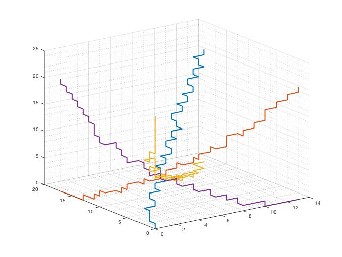
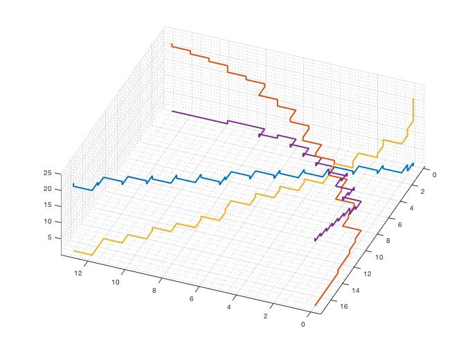
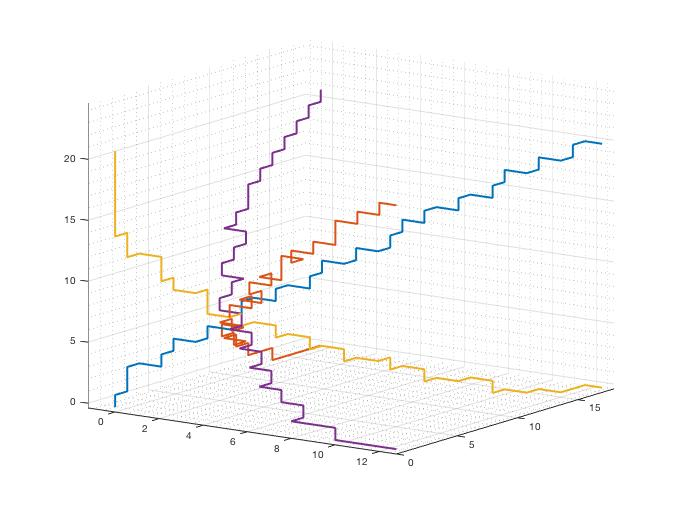

## Extreme Joint Distributions

This library provides a C++ implementation of the Extreme Joint Distribution (EJD) algorithm in [1].



### Dependencies
- CMake 3.15+
- C++17
- [Blaze](https://bitbucket.org/blaze-lib/blaze)
- Boost 1.67+ (relies on Boost.Math)
- [Discreture](https://github.com/mraggi/discreture)
- [fmt](https://github.com/fmtlib/fmt)
- ccache (optional)
- [HighFive](https://github.com/BlueBrain/HighFive) (optional for testing---reading of .mat files)

### Build
The usual CMake build procedure
```bash
mkdir build
cd build
cmake .. -DCMAKE_BUILD_TYPE=Release
ninja -j4
```

### References

If you find this library useful, please consider citing 
```
@article{chiu2017correlated,
  title={Correlated multivariate Poisson processes and extreme measures},
  author={Chiu, Michael and Jackson, Kenneth R and Kreinin, Alexander},
  journal={Model Assisted Statistics and Applications},
  volume={12},
  number={4},
  pages={369--385},
  year={2017},
  publisher={IOS Press}
}
```

[1] Chiu, Michael, Kenneth R. Jackson, and Alexander Kreinin. "Correlated multivariate Poisson processes and extreme measures." Model Assisted Statistics and Applications 12.4 (2017): 369-385. [[arxiv]](https://arxiv.org/abs/1702.00376) [[Model Assisted Statistics And Applications]](https://content.iospress.com/articles/model-assisted-statistics-and-applications/mas405)
